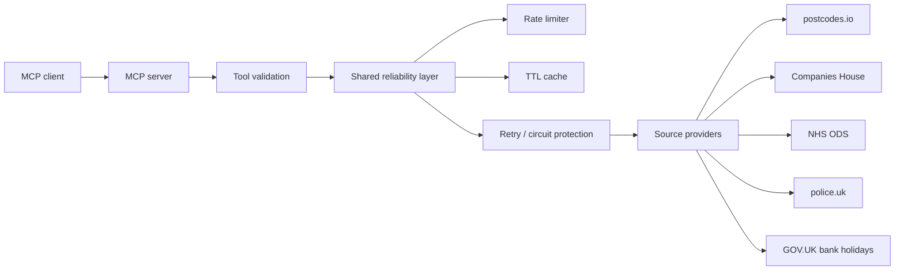

# UK Public Data MCP Server

A production-oriented MCP server for UK public data lookups. It exposes tools over stdio by default and can optionally run over Streamable HTTP for local or containerized deployments.

## Architecture



Every tool call flows through a shared runner that:

1. Applies a sliding-window rate limit (per MCP session when available, otherwise process-wide).
2. Checks the in-memory TTL cache and returns `cached: true` on hits.
3. Executes the provider, which uses the shared HTTP client.
4. The HTTP client enforces HTTPS, per-source throttles, per-upstream concurrency limits, timeouts, retries, and circuit breaking.
5. Results are returned in a consistent `{ data, meta }` envelope (or `{ error, meta }` on failure).

## Supported data sources

| Source | Base URL | Auth |
| --- | --- | --- |
| postcodes.io | `https://api.postcodes.io` | none |
| Companies House | `https://api.company-information.service.gov.uk` | `COMPANIES_HOUSE_API_KEY` (HTTP Basic) |
| NHS ODS | `ODS_BASE_URL` (default `https://directory.spineservices.nhs.uk/ORD/2-0-0/organisations`) | none |
| police.uk | `https://data.police.uk/api` | none |
| GOV.UK bank holidays | `https://www.gov.uk/bank-holidays.json` | none |

## Tool catalogue

### Postcodes

- `postcode_lookup` — normalized postcode, coordinates, region, country, constituency, local authority, county, codes.
- `postcode_nearest` — nearby postcodes for a latitude/longitude, with distance and administrative metadata.
- `postcode_search` — search postcodes by query text.

### Companies House

All Companies House tools require `COMPANIES_HOUSE_API_KEY`.

- `company_search` — search companies by name or number.
- `company_profile` — legal name, status, type, incorporation date, registered office, SIC codes, accounts, confirmation statement, jurisdiction, insolvency/cessation fields.
- `company_officers` — officers with role, name, appointed/resigned dates, nationality, occupation, country of residence.
- `company_filing_history` — filing date, category, description, transaction ID, document links.

### NHS ODS

- `ods_organisation_lookup` — organisation by ODS code.
- `ods_organisation_search` — search organisations with optional type filter, active-only flag, and limit.
- `ods_organisations_by_postcode` — organisations associated with a postcode.

### police.uk

- `police_forces` — list forces.
- `police_neighbourhoods` — neighbourhoods for a force.
- `police_crimes_at_location` — crimes near coordinates for an optional `YYYY-MM` month (must not be in the future).
- `police_crimes_by_postcode` — resolves a postcode via postcodes.io, then queries police.uk; returns a clear partial-result payload when postcode resolution succeeds but the police lookup fails.

### GOV.UK bank holidays

- `bank_holidays` — holidays for a division, optionally filtered locally by year.
- `next_bank_holiday` — the next holiday on or after `from_date` (default today) with days remaining.

## Example MCP calls

```json
{ "tool": "postcode_lookup", "arguments": { "postcode": "SW1A 1AA" } }
```

```json
{ "tool": "company_search", "arguments": { "query": "openai", "items_per_page": 10 } }
```

```json
{ "tool": "ods_organisation_lookup", "arguments": { "ods_code": "RJ1" } }
```

```json
{ "tool": "police_crimes_at_location", "arguments": { "latitude": 51.501, "longitude": -0.141, "date": "2026-01" } }
```

```json
{ "tool": "bank_holidays", "arguments": { "division": "england-and-wales", "year": 2026 } }
```

## Setup

1. Install dependencies:

   ```bash
   npm install
   ```

2. Copy the environment file:

   ```bash
   cp .env.example .env
   ```

3. Fill in `COMPANIES_HOUSE_API_KEY` if you want to use Companies House tools. All other tools work without credentials.
4. Start the server:

   ```bash
   npm run dev
   ```

## Configuration

Configuration is validated with Zod at startup. Invalid configuration fails fast with a clear error. A missing `COMPANIES_HOUSE_API_KEY` is allowed at startup; only Companies House tool calls return `CONFIGURATION_ERROR` until the key is provided.

| Variable | Default | Description |
| --- | --- | --- |
| `NODE_ENV` | `development` | Runtime environment |
| `LOG_LEVEL` | `info` | Pino log level |
| `MCP_TRANSPORT` | `stdio` | `stdio` or `http` |
| `PORT` | `3000` | HTTP port (HTTP transport only) |
| `COMPANIES_HOUSE_API_KEY` | — | Companies House API key |
| `COMPANIES_HOUSE_BASE_URL` | `https://api.company-information.service.gov.uk` | Companies House API base URL (use `https://api-sandbox.company-information.service.gov.uk` for a test/sandbox key) |
| `ODS_BASE_URL` | `https://directory.spineservices.nhs.uk/ORD/2-0-0/organisations` | NHS ODS endpoint base |
| `HTTP_TIMEOUT_MS` | `10000` | Per-request upstream timeout |
| `HTTP_MAX_RETRIES` | `3` | Max retry attempts per GET request |
| `RATE_LIMIT_REQUESTS` | `60` | Global requests per window per client |
| `RATE_LIMIT_WINDOW_MS` | `60000` | Global rate-limit window |
| `COMPANIES_HOUSE_RATE_LIMIT_REQUESTS` | `30` | Per-minute Companies House throttle |
| `POLICE_RATE_LIMIT_REQUESTS` | `30` | Per-minute police.uk throttle |
| `UPSTREAM_CONCURRENCY` | `4` | Max simultaneous requests per upstream |
| `CACHE_ENABLED` | `true` | Enable the in-memory TTL cache |
| `POSTCODES_CACHE_TTL_MS` | `86400000` | Postcodes cache TTL (24 h) |
| `COMPANIES_HOUSE_CACHE_TTL_MS` | `900000` | Companies House cache TTL (15 min) |
| `ODS_CACHE_TTL_MS` | `86400000` | ODS cache TTL (24 h) |
| `POLICE_CACHE_TTL_MS` | `300000` | police.uk cache TTL (5 min) |
| `BANK_HOLIDAYS_CACHE_TTL_MS` | `43200000` | Bank holidays cache TTL (12 h) |

## Running locally

```bash
npm run dev          # stdio transport via tsx
npm run build        # compile TypeScript to dist/
node dist/src/index.js
```

## Claude Desktop configuration

Add a server entry like this in your Claude Desktop configuration:

```json
{
  "mcpServers": {
    "uk-public-data": {
      "command": "node",
      "args": ["/absolute/path/to/uk-public-data-mcp/dist/src/index.js"],
      "env": {
        "COMPANIES_HOUSE_API_KEY": "your-key-here"
      }
    }
  }
}
```

## HTTP transport and health endpoint

Set `MCP_TRANSPORT=http` and `PORT=3000` (or another port) to run a Streamable HTTP server:

```bash
MCP_TRANSPORT=http PORT=3000 npm run dev
```

- MCP endpoint: `POST /mcp`
- Health endpoint: `GET /health` (available only in HTTP transport mode; stdio has no HTTP health endpoint)

## Docker

```bash
docker build -t uk-public-data-mcp .
docker run --rm -it uk-public-data-mcp
```

Or with Docker Compose:

```bash
docker compose up --build
```

The image runs as the non-root `node` user.

## Deploy to Render (one click)

The repository includes a Render Blueprint (`render.yaml`) that deploys two free
services:

- **uk-public-data-mcp** — the MCP server in HTTP mode.
- **uk-public-data-mcp-inspector** — a hosted MCP Inspector web UI for trying the tools.

Steps:

1. Push this repo to GitHub.
2. In Render: **New → Blueprint → connect the GitHub repo**.
3. Enter `COMPANIES_HOUSE_API_KEY` and `MCP_PROXY_AUTH_TOKEN` when prompted (both are `sync: false`, so they are never stored in the repo).
4. Deploy.

After deployment:

- MCP server: `https://uk-public-data-mcp.onrender.com/mcp` (health check at `/health`)
- Inspector UI: `https://uk-public-data-mcp-inspector.onrender.com/?MCP_PROXY_AUTH_TOKEN=<your-token>`

In the Inspector, select **Streamable HTTP**, enter
`https://uk-public-data-mcp.onrender.com/mcp`, and click **Connect**.

Free Render instances sleep after inactivity, so the first request after idle
may take a minute to wake up.

## Testing

```bash
npm test
npm run test:coverage
npm run lint
npm run typecheck
npm run build
```

Tests use Vitest with all external HTTP calls mocked via realistic, non-sensitive fixtures. Coverage thresholds: 80% lines/statements/functions and 75% branches.

## Reliability, rate limits, and caching

- **Retries**: only idempotent `GET` requests are retried, and only for network errors, `408`, `429`, `500`, `502`, `503`, and `504`. Backoff is exponential with jitter and honours `Retry-After` headers (capped at 60 s). Validation errors, authentication failures, and other 4xx responses are never retried.
- **Circuit breaker**: after five consecutive upstream failures to the same endpoint, the breaker opens for 20 s and requests fail fast with `UPSTREAM_UNAVAILABLE`.
- **Timeouts**: per-request timeout via `HTTP_TIMEOUT_MS` (default 10 s).
- **Rate limiting**: sliding-window limit scoped by MCP session/client identity when available (otherwise process-wide). Denied calls return a structured `UPSTREAM_RATE_LIMITED` error with `retry_after_seconds`.
- **Source throttles**: Companies House and police.uk have dedicated throttles (30 requests/minute by default) independent of the global client limit.
- **Concurrency**: each upstream is limited to `UPSTREAM_CONCURRENCY` (default 4) simultaneous requests.
- **Caching**: in-memory TTL cache per source. Only successful responses are cached, cache keys are namespaced per tool/arguments and never contain credentials, and responses include `cached: true|false` in `meta`.
- **Security**: HTTPS-only endpoints, secrets only from environment variables, authorization headers and sensitive query values are redacted in logs, and raw upstream error bodies are never exposed.

## Response envelope

Successful tool responses use:

```json
{
  "data": { "...": "normalized snake_case fields" },
  "meta": {
    "source": "postcodes.io",
    "source_url": "https://...",
    "retrieved_at": "2026-09-21T18:00:00.000Z",
    "cached": false,
    "request_id": "uuid"
  }
}
```

Failures use:

```json
{
  "error": {
    "code": "NOT_FOUND",
    "message": "No company was found for company number 12345678.",
    "retryable": false,
    "retry_after_seconds": null
  },
  "meta": {
    "source": "companies-house",
    "request_id": "uuid"
  }
}
```

## Data freshness and limitations

- **postcodes.io** responses are cached for 24 hours; postcode geography changes slowly.
- **Companies House** profiles and searches are cached for 15 minutes.
- **police.uk** data is cached for 5 minutes. Historical crime coverage is subject to source-specific availability windows (typically the most recent 13–36 months depending on force and category). Coordinates may be anonymised upstream.
- **NHS ODS** data is cached for 24 hours. The ODS endpoint contract may vary by deployment; `ODS_BASE_URL` makes endpoint substitution straightforward and the provider is isolated behind the `OdsAdapter` interface.
- **Bank holidays** are cached for 12 hours. `next_bank_holiday` is never cached because its `days_until` value is relative to the current date.

## Privacy notes

- `police_crimes_at_location` and `police_crimes_by_postcode` include an explicit privacy note that police.uk crime locations are approximate and may be anonymised by the upstream service.
- The server does not log full postcode payloads; only redacted request metadata is logged.
- No upstream credentials are included in responses or logs.

## Attribution

This project uses public data from:

- [postcodes.io](https://postcodes.io)
- [Companies House](https://www.gov.uk/companieshouse)
- [NHS Organisation Data Service (ODS)](https://digital.nhs.uk/services/organisation-data-service)
- [police.uk](https://www.police.uk)
- [GOV.UK bank holidays](https://www.gov.uk/bank-holidays)

## Known limitations and future improvements

- The NHS ODS default endpoint targets the directory.spineservices.nhs.uk ORD API; the adapter contract assumes `GET {base}/{code}`, `GET {base}/search?q=`, and `GET {base}/postcode?postcode=`. Substituting a different ODS source only requires a new `OdsAdapter` implementation.
- The in-memory cache and rate-limit state are per-process; multi-instance deployments would benefit from a shared cache/limiter (for example Redis).
- The HTTP transport runs in stateless mode (a fresh MCP server per request) with shared cache/rate-limit/HTTP client state.
- Some upstream responses are field-rich and may omit optional attributes; the server normalizes the most relevant fields and leaves missing values unset.
